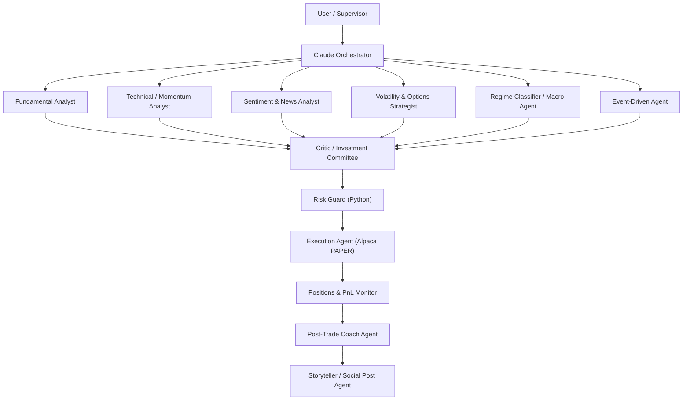

# Multi-Agent Options Desk

A Claude-orchestrated options trading desk for the **Alpaca AI Trading Agents Hackathon**.
Six research agents argue, an investment-committee critic decides, and a
**deterministic Python risk guard** has the final word — every trade lands on a
dedicated Alpaca **paper** account with a full decision trace behind it.

> **Paper trading only.** The Alpaca client refuses to construct against a live
> brokerage endpoint. This is a research project, not financial advice.



---

## The one idea worth stealing

The most dangerous failure mode of an LLM trading system is **a persuasive
argument for an oversized position**. So every irreversible action on this desk
is gated by code that cannot be persuaded.

The agents supply judgement. The Risk Guard supplies limits. Neither is allowed
to do the other's job:

- `risk_guard.py` contains **no LLM calls and no network access**. It is pure
  functions over the portfolio, the candidate trades, and the configured limits.
- Execution accepts input **only** from the guard's approved list, at the
  quantity the guard returned. There is no other code path to the broker.
- The `submit_orders` MCP tool **re-runs the guard itself** rather than trusting
  a caller that says it already checked.
- Anything ambiguous — a missing max loss, an unparseable symbol, a malformed
  payload — **fails closed**.
- A structure's max loss is derived from its **expiry payoff curve**, not from a
  label. That is how a "ratio spread" with unbounded loss gets caught even when
  every agent involved swears it is defined-risk.

---

## Quickstart

```bash
git clone https://github.com/kOkO34344/MultiAgentTrader.git
cd MultiAgentTrader
python3 -m venv .venv && source .venv/bin/activate
pip install -e ".[dev]"

cp .env.example .env      # add your Alpaca PAPER keys
desk doctor               # pre-flight: config, keys, paper account, state
desk run-cycle --phase morning --dry-run
```

**It runs with no API keys at all.** With `ANTHROPIC_API_KEY` unset, every agent
falls back to deterministic, feature-derived reasoning instead of failing, so
the whole chain — research → committee → risk gate → execution → journalling —
works offline. That is what makes the 185-test suite meaningful: CI exercises
the real pipeline with zero credentials and zero network calls.

Set `ANTHROPIC_API_KEY` and the same agents call Claude for real. Nothing else
changes.

---

## Commands

| Command | What it does |
|---|---|
| `desk doctor` | Pre-flight check: config, credentials, paper account, playbooks, heartbeat |
| `desk run-cycle --phase morning` | One full decision cycle |
| `desk competition --plan` | Print the Aug 28 – Sep 4 run plan |
| `desk competition` | Run whichever competition cycle is due now |
| `desk backtest` | Replay the desk's logic over history |
| `desk dashboard` | Terminal dashboard (add `--watch` to auto-refresh) |
| `desk dashboard --web` | Web dashboard at `http://127.0.0.1:8787` |
| `desk journal` / `desk story` | Post-trade review + the day's social post |
| `desk experiments` | List, create, and activate experiment configs |
| `desk tools` | List the MCP tools and their schemas |
| `desk mcp-server` | Serve the MCP tools over stdio |

`--dry-run` is the default everywhere. Pass `--live` to actually place paper orders.

---

## The agents

Every persona lives in `config/prompts/` as a versioned Markdown file, hashed
into the experiment registry so a prompt edit shows up in the results.

| Agent | Role | Its most valuable output |
|---|---|---|
| **Fundamental Analyst** | Valuation, catalysts, balance-sheet risk | A dated catalyst with a structure to express it |
| **Technical Analyst** | Trend quality, levels, momentum | The **invalidation level** — where the trade is wrong |
| **Sentiment & News** | Narrative, positioning, headline risk | A **veto**: "right idea, wrong week" |
| **Volatility & Options** | Surface reading and structuring | The concrete legs, with max loss computed |
| **Regime Classifier** | What kind of market is this? | The label that gates every playbook |
| **Event-Driven** | The calendar | Usually `stand_aside` |
| **Critic / Committee** | Selects, reshapes, kills | Rejections with reason codes |
| **Post-Trade Coach** | Reviews *process*, not outcomes | `lessons_for_tomorrow` with exact config keys |
| **Storyteller** | The daily build log | An honest post, including the losses |

### Three design decisions worth explaining

**1. The regime classifier is deterministic-first.**
Python computes ADX, EMA slope, Bollinger bandwidth, ATR percentile and IV rank,
and that produces the **authoritative** label. The LLM adds narrative and may
override it *only* above a configured confidence threshold **and** with a
concrete reason — and every override is logged for the Coach to review.
Indicators are stable but blind; the model is perceptive but inconsistent. This
split keeps the regime stable by default and flexible under real conviction.

**2. The Critic judges expectancy, not risk/reward.**
A 0.25 risk/reward iron condor is a *good* trade at an 80% win rate and a bad one
at 50%. A flat R:R floor would reject the desk's core strategy outright. So the
desk computes probability of profit from the expiry payoff curve under the
**realised**-volatility distribution, while the structure is *priced* at
**implied** volatility. That gap is the variance risk premium — the actual source
of edge in premium selling. Measuring both under implied vol would score every
structure at zero expectancy by construction, which is true under risk-neutral
pricing and useless as a decision rule.

**3. Agents that fail, abstain.**
A research agent that errors, times out, or gets refused returns an *abstention*
that is recorded in the trace. One broken specialist never takes down a cycle.

---

## Risk controls

All configured in `config/settings.yaml` and enforced in `src/desk/risk/`.

| Category | Enforced |
|---|---|
| **Notional** | per trade, portfolio total, per ticker |
| **Size** | contracts per trade, per ticker, open-position count |
| **Greeks** | portfolio net delta, gamma, vega, theta |
| **Time** | minimum days to expiry |
| **Structure** | finite max loss required; naked shorts and net-short ratios rejected |
| **Capital** | cash buffer, buying-power utilisation |
| **Circuit breakers** | daily loss limit, peak-to-trough drawdown halt |
| **Universe** | ticker whitelist |
| **Throttles** | trades per day, new tickers per day |
| **Hygiene** | duplicate and offsetting position detection |

Verdicts are `APPROVE`, `RESIZE` (with an approved quantity), or `REJECT`, each
with machine-readable reason codes. Two behaviours are worth calling out:

- **Resize before reject.** A trade breaching only a *size* cap is approved at
  the largest quantity that fits. Only structural breaches are rejected outright.
- **Hedges are never blocked by the limit they reduce.** A trade that moves a
  portfolio Greek back toward zero passes even while the portfolio is over that
  limit — otherwise the guard would trap the desk in the exposure it is meant
  to prevent.

---

## MCP server

Eight tools, schemas exactly as specified, served over stdio:

```bash
claude mcp add options-desk -- desk mcp-server
```

| Tool | Purpose |
|---|---|
| `get_equity_bars` | OHLCV bars + derived indicators |
| `get_options_chain` | Chain snapshots with bid/ask, IV, greeks |
| `get_options_bars` | Historical bars for option contracts |
| `get_account_state` | Cash, equity, buying power, margin |
| `get_positions` | Open equity and option positions |
| `get_open_orders` | Currently working orders |
| `submit_orders` | Place orders — **re-runs the Risk Guard first** |
| `risk_guard_check` | Deterministic pre-trade risk evaluation |

Every response is a uniform envelope — `{ok, data, error, error_type, retryable}` —
so a caller can distinguish "rate limited, retry" from "malformed, don't".
Large chains are capped with an explicit `truncated` flag. Greeks missing from
the feed are solved with Black-Scholes, so no contract is ever returned whose
risk the desk cannot compute.

Inspect the schemas without starting a server: `desk tools --json`.

---

## Observability

Every agent output, critic verdict, and risk reason code is persisted to SQLite
against the cycle that produced it. Any trade can be explained after the fact.

```bash
desk dashboard          # equity sparkline, positions, trades, decision traces
desk dashboard --web    # same, in a browser, with a P&L chart
```

The web dashboard is a single self-contained HTML page with an inline SVG chart —
no build step, no CDN, works with no network. `monitor/heartbeat.json` is written
every cycle; both dashboards and `desk doctor` alert when it goes stale, because
a silent trading system is indistinguishable from a dead one.

---

## Backtesting

```bash
desk backtest --start 2025-01-02 --end 2025-06-30
```

The replay runs the **same** regime → playbook → structure → risk-guard logic as
the live desk, so a backtest cannot take risk the live desk would have refused.

**Read this before quoting a number.** Alpaca does not serve historical option
*chain snapshots*, so a faithful replay of what was quotable on a given morning
is not possible. The engine prices a synthetic chain with Black-Scholes, using
trailing realised volatility plus a variance risk premium as the IV input, and
models a bid-ask spread. Results are **indicative, not exact**: they show whether
the regime and playbook logic is coherent, not what the desk would have banked.
Every metric carries a `pricing_source` field so the distinction survives into
the experiment registry.

Metrics — cumulative P&L, max drawdown, Sharpe, Sortino, hit rate, profit factor,
expectancy, outcome distribution, plus options-specific stats — are computed by
the **same module** for backtest and live, so the two are directly comparable.

---

## Competition mode

```bash
desk competition --plan   # see the whole run plan
desk competition          # run whichever cycle is due
```

Daily schedule (US/Eastern, all configurable):

| Time | Cycle | What happens |
|---|---|---|
| 08:45 | `premarket` | Regime classification, watchlist selection, no trades |
| 10:00 | `morning` | Full research → committee → risk → execute |
| 13:30 | `midday` | Monitoring, hedges, adjustments (strict cap) |
| 15:45 | `eod` | Coach review, social post, metrics |

The week's arc is configuration, not improvisation: **explore** small on sessions
1–2, **concentrate** on what worked on 3–5, then **freeze** prompts and settings
and run consistently to the finish. Phases count *trading* days — the window
opens on a Friday, and a calendar count would spend the exploration phase on a
Saturday.

---

## Experiments

Every backtest and live session is logged against an experiment id, together
with a content hash of every prompt and the config that produced it.

```bash
desk experiments
desk experiments --create condor-heavy-v2 --description "Range playbooks only"
```

Without this, "the iron condors worked better this week" is an anecdote.

---

## Project layout

```
config/
  settings.yaml              # universe, risk limits, regime thresholds, schedule
  prompts/*.md               # 11 agent personas, versioned and hashed
  strategies/playbooks.yaml  # regime -> options structures + conditions
  experiments/               # experiment registry
src/desk/
  orchestrator/              # cycle coordination, fan-out, competition mode
  agents/                    # research, critic, coach, storyteller
  risk/                      # the deterministic guard  <- no LLM here
  alpaca/                    # client (paper-only guard), market data, execution
  mcp/                       # the 8 MCP tools + stdio server
  backtest/                  # replay engine, dataset cache, metrics
  monitor/                   # state store, heartbeat, dashboards
  utils/                     # config, logging, time, options maths, symbols
tests/                       # 185 tests, no network, no API keys
docs/                        # architecture, runbook, competition plan
```

**A note on the layout:** the spec this was built from placed `alpaca/` and
`mcp/` at the top of `src/`. Both would *shadow* the installed `alpaca-py` and
MCP SDK packages they wrap, breaking the very libraries they depend on. Every
module name and role is preserved; only the import root differs.

---

## Development

```bash
pytest -q                 # 185 tests, offline, no credentials
ruff check src tests
```

Further reading: [`docs/ARCHITECTURE.md`](docs/ARCHITECTURE.md) ·
[`docs/RUNBOOK.md`](docs/RUNBOOK.md) · [`docs/COMPETITION.md`](docs/COMPETITION.md)

## License

MIT — see [LICENSE](LICENSE). Not financial advice. Paper trading only.
