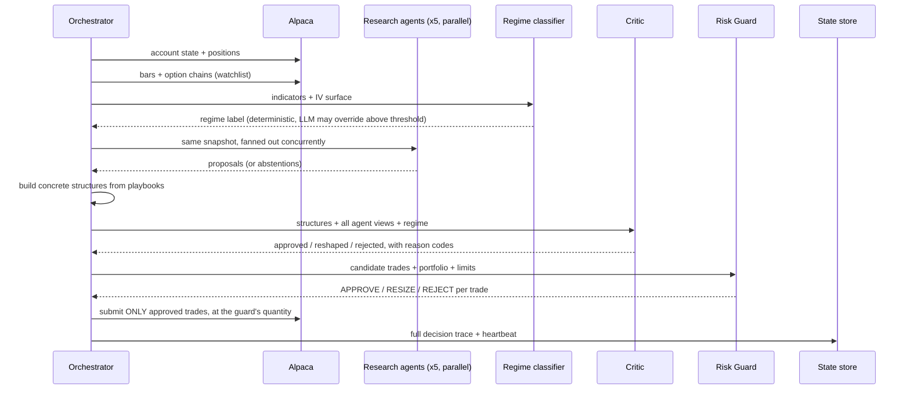

# Architecture

## The cycle

One `desk run-cycle` is a linear pipeline with one parallel stage and exactly
one gate to the broker.

Every arrow into `A` on the last line originates from `G`, never from `C`.
That is the safety property the whole design exists to guarantee.

## Modules

| Package | Responsibility | Depends on |
|---|---|---|
| `desk.utils` | Config, logging, market clock, options maths, OCC symbols | nothing internal |
| `desk.risk` | The deterministic guard | `utils` only — **never** `alpaca` or `agents` |
| `desk.alpaca` | Client (paper-only guard), market data, execution | `utils` |
| `desk.agents` | Personas, structure building, critic, coach, storyteller | `utils` |
| `desk.orchestrator` | Cycle coordination, fan-out, competition mode | everything |
| `desk.mcp` | Tool schemas and stdio server | `alpaca`, `risk` |
| `desk.backtest` | Replay engine, dataset cache, shared metrics | `agents`, `risk`, `utils` |
| `desk.monitor` | State store, heartbeat, dashboards | `utils` |

`desk.risk` deliberately sits at the bottom of the dependency graph with no path
to the network or to an LLM. It cannot call out even by accident.

## Key design decisions

### Risk is computed from the payoff curve, not from labels

`risk_profile()` scans terminal prices from zero to three times spot, evaluates
the structure's expiry payoff at each point, and reads max loss, max profit, and
breakevens off the resulting curve. Unbounded exposure is detected by checking
whether the payoff is still moving at the edges of the grid.

This means one code path handles verticals, condors, butterflies, straddles and
anything the playbook library grows later — and, more importantly, a structure
labelled "defined risk" that *isn't* gets caught by the arithmetic rather than
being taken on trust.

### Probability of profit under realised vol, pricing under implied vol

Under risk-neutral pricing every option structure has zero expected value minus
costs, so scoring a structure with its own implied vol would rate everything at
zero expectancy — technically true, practically useless.

The desk instead prices the structure at **implied** volatility (what the market
charges) and estimates its win probability under the **realised** distribution
(what the underlying actually does). The gap between the two is the variance
risk premium, and it is the entire thesis of premium selling.

### Deterministic-first regime classification

The Python classifier owns the label. The LLM may override only above a
configured confidence threshold **and** with a concrete reason, and the override
is logged. Fallback (mock) mode can never override — only a real model gets that
authority.

### Graceful degradation everywhere

| Failure | Behaviour |
|---|---|
| No Anthropic key | Agents use deterministic, feature-derived reasoning |
| Agent errors or times out | Abstains; the abstention is recorded |
| Model refuses the request | Treated as an abstention, never an exception |
| Option chain unavailable for a ticker | That ticker is skipped; the rest trade |
| Greeks missing from the feed | Solved with Black-Scholes from the mid |
| Risk Guard tool errors | Treated as `REJECT` — fail closed |
| Heartbeat write fails | Logged; the cycle still completes |

### Multi-leg order encoding

Options structures go to Alpaca as `order_class="mleg"` with an `OptionLegRequest`
per leg. The **sign of the limit price carries the direction of the cash flow**:
positive is a net debit paid, negative a net credit received. Limits are priced
off the NBBO mid and crossed by a configured fraction of the spread, floored at
one tick — a percentage of a tight spread rounds to zero and leaves the order
resting unfilled.

Every order carries a deterministic `client_order_id` derived from the cycle,
trade, symbols and quantity, so a retry collides on the broker side instead of
opening a second position.

## What is deliberately not implemented

**Multi-expiry structures** (diagonals, calendars). The payoff engine models a
single expiry; a diagonal's long leg outlives the short one, so that curve does
not describe it. Rather than ship a structure whose risk the guard cannot
verify, the desk does not trade it. Adding one means extending the payoff engine
first — the omission is recorded in `config/strategies/playbooks.yaml`.

**Fabricated fundamentals and news.** With no data source configured, the
Fundamental Analyst abstains and the Sentiment Analyst reports `coverage: none`
with a score of `0.0` rather than inventing metrics or headlines. Event risk
still flows from the structured calendar, so the binary-event veto keeps working
without a news feed.
